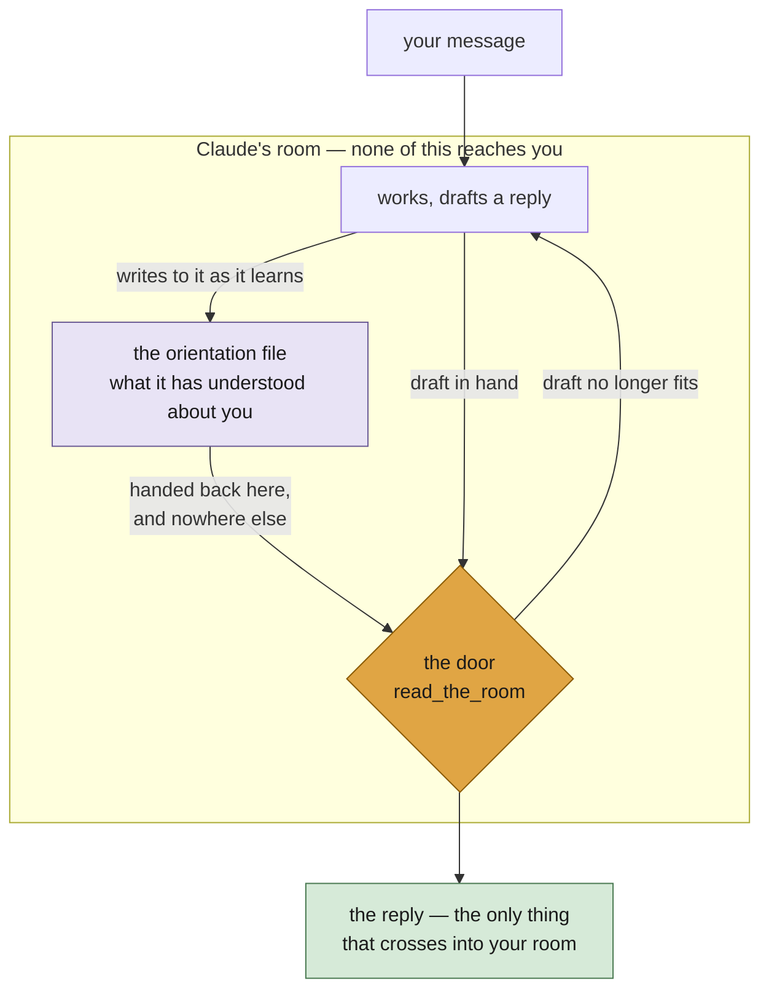

# Read the Room

**Read the Room keeps a file of what you actually asked for, and makes Claude
Code read it back to itself in the moment before it replies.**

Claude finishes thinking, finishes its tool calls, and then the only way to end
its turn is to say something to you. Nothing sits in that gap. So whatever was
last in its hands goes into your lap — half-finished reasoning, the thing it
just got interested in, a confident answer to a question you didn't ask.

This puts something in the gap.



The file is written throughout the turn and read at one moment — the door,
immediately before Claude speaks. It never crosses into your room.

## What it does

**Keeps an orientation file.** One per session, written and maintained by
Claude, about you: what you're working on, what you asked for, your words for
things, what you've already settled. You never have to open it. It ends with
the session — this is orientation, not memory.

**Reads it at the last moment.** Not at the start, where it scrolls out of
reach — immediately before speaking, when it can still change what gets said.

**Hides Claude's working notes** behind a single line. Nothing is deleted; the
text stays in the transcript and `ctrl+O` opens it. Set
`CLAUDE_ORIENTATION_SUPPRESS=0` to see everything instead.

## What it can't do

Nothing inspects Claude's reply or blocks it. This plugin simply puts a reflection and theory of mind step into Claude's process. How far that improves interaction is an open question.

## Install

Needs Claude Code and **Node.js on your PATH**; everything here runs on it, and
without it nothing runs and it fails quietly.

```sh
claude plugin marketplace add hackerbara/read-the-room && claude plugin install read-the-room@read-the-room
```

Restart Claude Code. Nothing else to configure.

## Use

Nothing to invoke. It runs on every session.

The one thing worth knowing: if a reply doesn't meet where you are — your
terms, your sense of the problem, something you already told it — say so. The
orientation file is Claude's read on you, and that's what corrects it.

## More

[How it works](how-it-works.md) — the mechanism, with diagrams, and what it
costs.

## Licence

MIT.
