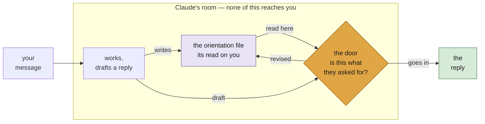

# Read the Room

**Read the Room keeps a file of what you actually asked for, and makes Claude
Code read it back to itself in the moment before it replies.**

Claude finishes thinking, finishes its tool calls, and then the only way to end
its turn is to say something to you. Nothing sits in that gap. So whatever was
last in its hands goes into your lap — half-finished reasoning, the thing it
just got interested in, a confident answer to a question you didn't ask.

This puts something in the gap.



The file is written throughout the turn and read at one moment — the door,
immediately before Claude speaks. The door is a decision, not a formality:
what comes back can change the reply, or change the file. Only the reply
crosses.

## What it does

**Keeps an orientation file.** One per session, written and maintained by
Claude, about you: what you're working on, what you asked for, your words for
things, what you've already settled. You never have to open it. It ends with
the session — this is orientation, not memory.

**Reads it at the last moment.** Not at the start, where it scrolls out of
reach — immediately before speaking, when it can still change what gets said.

**Hides Claude's working notes** behind a single line. Nothing is deleted; the
text stays in the transcript and `ctrl+O` opens it. Set
`CLAUDE_ORIENTATION_SUPPRESS=0` to see everything instead.

**Sometimes asks for upkeep before the door opens.** When the file has sat
untouched too long, grown past its budget, or is still the blank template,
the door hands Claude a key: bring the file current, then come back in. The
check is content-blind — it verifies that things changed, never what they
say — and if the upkeep fumbles twice, the door opens anyway and the miss
goes on record.

**Lets Claude stay in its room.** A turn can end with a one-line marker
instead of a reply — deliberate, counted, and visible — for turns that are
honest waiting rather than something worth saying.

## What it can't do

Nothing inspects Claude's reply or blocks it. The key's checks are hashes
and byte counts; nothing ever reads or judges what the file says. This
plugin simply puts a reflection and theory of mind step into Claude's
process. How far that improves interaction is an open question.

## Install

Needs Claude Code and **Node.js on your PATH**; everything here runs on it, and
without it nothing runs and it fails quietly.

```sh
claude plugin marketplace add hackerbara/read-the-room && claude plugin install read-the-room@read-the-room
```

Restart Claude Code. Nothing else to configure.

## Use

Nothing to invoke. It runs on every session.

The one thing worth knowing: if a reply doesn't meet where you are — your
terms, your sense of the problem, something you already told it — say so. The
orientation file is Claude's read on you, and that's what corrects it.

## More

[How it works](how-it-works.md) — the mechanism, with diagrams, and what it
costs.

The thinking behind the design owes a debt to Trivedi, Jaques, Cross,
Vezhnevets & Leibo, ["Solipsistic Superintelligence is Unlikely to be
Cooperative"](https://arxiv.org/abs/2606.03237): AI that treats the world
as an exogenous and stationary source of feedback fails among adaptive
actors. This plugin is a session-scale response to that observation — one
small machine for remembering that the person moves.

## Licence

MIT.
