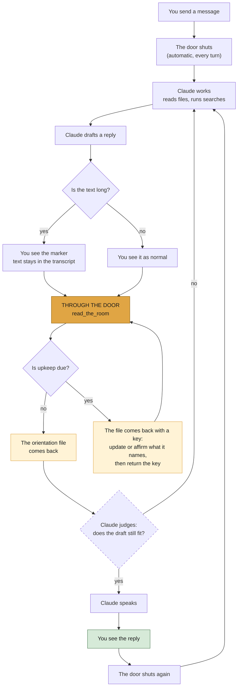
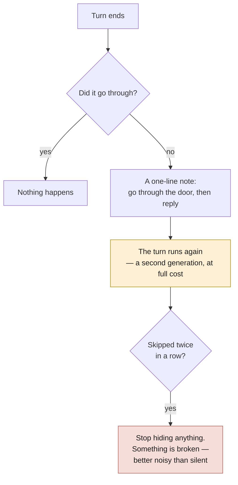

# How it works

The mechanism. If you haven't read the [README](README.md), start there — it
sets up the two rooms and the orientation file that this depends on.

---

## The one-sentence version

**Claude writes its reply, then reads its orientation file, and only then
speaks.**

---

## The door

There is one moment where Claude crosses from its room into yours: the moment
it speaks. Read the Room puts a door there.

Going through the door means calling a tool, `read_the_room`. It is permission
to speak, not a test to pass — nothing reads what Claude wrote, judges it, or
blocks it. What the door does is hand back the orientation file at the one
moment it can still change the reply.

---

## A turn, start to finish



The dashed box is the only step nothing enforces. Every other box is machinery;
that one is Claude's own judgement, and it can go either way.

The file arrives after the draft exists and before it is delivered — late
enough to change it, early enough that changing it costs nothing but tokens.

---

## One crossing, one reply

The door shuts again the moment something is delivered.

If Claude keeps working afterwards and writes more, that text is its own again:
kept in the transcript, not put in front of you. To say a second thing, it has
to come back through the door.

When a turn ends with text written after Claude already spoke, it gets told so
and asked whether that was meant for you. That only fires for text past the
hiding threshold — a short trailing line goes unremarked.

A turn can also end without a reply at all. If Claude is waiting on
something — a background agent, a long build — it can stay in its room, and
you see one line: `■ stayed in this turn — <note> (nothing was said; ctrl+O
for the workspace)`. Staying is legal and counted; past 3 consecutive stays
the machinery asks it to either come through with something or tell you
plainly that it is holding, and why.

---

## What comes back through the door

The orientation file. Claude writes and maintains it; nothing else does. It
holds what Claude understands about where you're standing:

```
## What they're working on
Migrating the billing service off the legacy queue. Week three.

## What they asked for
A list of every consumer still reading from the old topic.
NOT a migration plan — they said twice they'll sequence it themselves.

## Their words
"the old topic" = billing-events-v1. "cutover" means DNS, not data.

## What they've already settled
Kafka stays. Don't reopen it.

## What I don't know
Whether the staging consumers count.
```

Each section header comes back stamped with its own age — `(changed turn 41,
9 ago)` — along with how much Claude wrote to itself this turn. The file's
size appears only once it matters: past the pruning limit, as part of the
key's reasons.

The periodic staleness nudges that used to fire at turn counts are gone —
the key replaced them, and their removal trims what gets injected into
every turn.

---

## The key

Three conditions make the door ask for upkeep before it opens. Each hands
back a key instead of opening; doing the upkeep and returning the key is
what opens the door.

- **Setup** — the file is still the blank template. Usually that means the
  first crossing of a session; it keeps asking on later crossings if the
  file stays untouched, so the room gets set up before anything else.
- **Freshness** — a watched section has gone more than 6 turns untouched.
  Updating it counts; so does affirming it — "I re-read this just now and
  it still holds."
- **Pruning** — the file has grown past 5,000 bytes. Only actually landing
  back under the limit counts; no affirmation answers this one.

The checks are content-blind throughout: a hash moved, a byte count fell.
Nothing reads what the words say — the design rule is *any real change
counts*. Every key event — issued, satisfied, affirmed, fumbled, stood
down, snoozed, and a turn that ends with a key unreturned — lands in a
small ledger file, so cheap compliance is at least visible compliance.

If the upkeep fumbles twice, the door stands down: it opens anyway, the
miss goes on the ledger, and that reason rests for 6 turns. Failing toward
speech is the rule everywhere — no key can leave you unable to hear Claude.

---

## What you see, and what Claude sees

Three things exist on Claude's side of a turn. Only one of them arrives whole.

| Claude produces | reaches your screen as |
|---|---|
| **working notes** — the draft, the thinking, the discarded attempts | one line: `⋯ working notes — 12 lines · press ctrl+O to expand` |
| **the orientation file** — its running read on you | nothing at all; it is never displayed |
| **the reply** | the reply, in full |

`ctrl+O` is Claude Code's toggle for showing everything in the conversation.
Nothing is deleted — hidden text stays in the transcript and that toggle opens
it. The hiding is display-only; Claude still sees everything it wrote.

Hiding is on by default; `CLAUDE_ORIENTATION_SUPPRESS=0` turns it off and you
see every word Claude writes. The first time text is hidden in a session, the
marker expands into a short paragraph explaining what happened.

The orientation file is never shown to you at either setting. You can read it
if you want — it's a file on disk — but it's written for Claude.

---

## If Claude doesn't go through the door



The note points at the door and does not include the file itself, so skipping
the door still costs something.

Re-running the turn is a real second generation — tokens and latency. It
happens at most twice by default before the machinery stands down.

The last box is the failure posture: if the tool breaks, you must never be left
unable to see Claude. It fails toward showing you too much.

---

## What it costs

Per turn: one extra tool call, and a handful of small file reads and writes.

If Claude forgets the door: up to two extra generations of the whole turn.

On disk: roughly fifteen small state files per session in your system temp
directory, under `claude-orientation/`. They are removed when the session
ends, and a fourteen-day sweep catches anything a crash leaves behind.

---

## What it doesn't do

- **It doesn't check the reply.** Nothing reads what Claude wrote and judges it.
- **Nothing reads the file's content, either.** The door can now require
  upkeep before it opens, but its checks are hashes and byte counts — that
  something changed, never what it says — and after two fumbles it opens
  regardless.
- **It doesn't make replies shorter.**
- **It isn't memory.** The orientation file is per-session. A new session
  starts with a blank one.

---

## The documents you can edit

Two documents tell Claude how to keep the orientation file: `orientation.md`,
the full version, and `orientation-brief.md`, a short form used after a
compaction. They ship as templates and are copied on first run into a directory
that survives plugin updates, so your edits are never overwritten.

They are written in the second person, addressed to Claude. **"Your room" in
those documents means Claude's room** — the opposite of what it means here.

---

## Configuration

One variable is worth knowing, and you only need it if you want the default
turned off:

```sh
export CLAUDE_ORIENTATION_SUPPRESS=0   # show working notes instead of hiding them
```

Replies under 100 characters are exempt from the missed-door nudge — a
one-line answer does not owe a crossing. The exemption never applies while a
key is outstanding: a keyed turn owes its upkeep whatever the reply length.
`CLAUDE_ORIENTATION_STOP_MIN_CHARS` changes the threshold; 0 removes the
exemption.

The key's knobs, all settable in your settings `env` block:
`CLAUDE_ORIENTATION_FRESH_AT` (6 turns), `CLAUDE_ORIENTATION_PRUNE_AT`
(5,000 bytes, strict), `CLAUDE_ORIENTATION_SETUP_KEY` (on; 0 disables),
`CLAUDE_ORIENTATION_STAY_CAP` (3 consecutive stays),
`CLAUDE_ORIENTATION_SNOOZE` (6 turns of rest after a stand-down).

The current defaults are deliberately tight — hiding at 150 characters,
the exemption at 100, pruning at 5,000 — chosen to see what real pressure
does rather than derived from long use. Expect them to move.

A kill switch, `CLAUDE_ORIENTATION_STOP=0`, disables the backstop entirely.
The remaining tuning variables are named in the hook sources and none are
required.

"Orientation" is this project's older internal name. It survives in the
environment variables, the state directory, and the document filenames.
